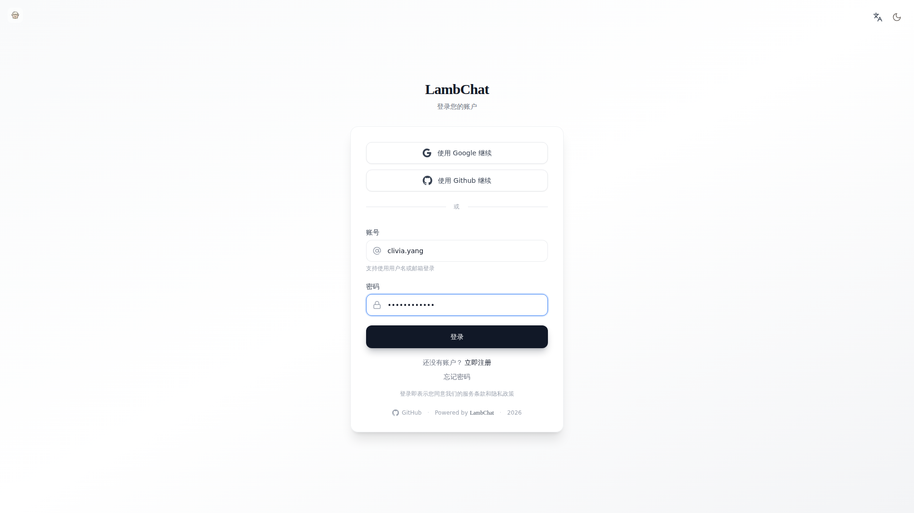
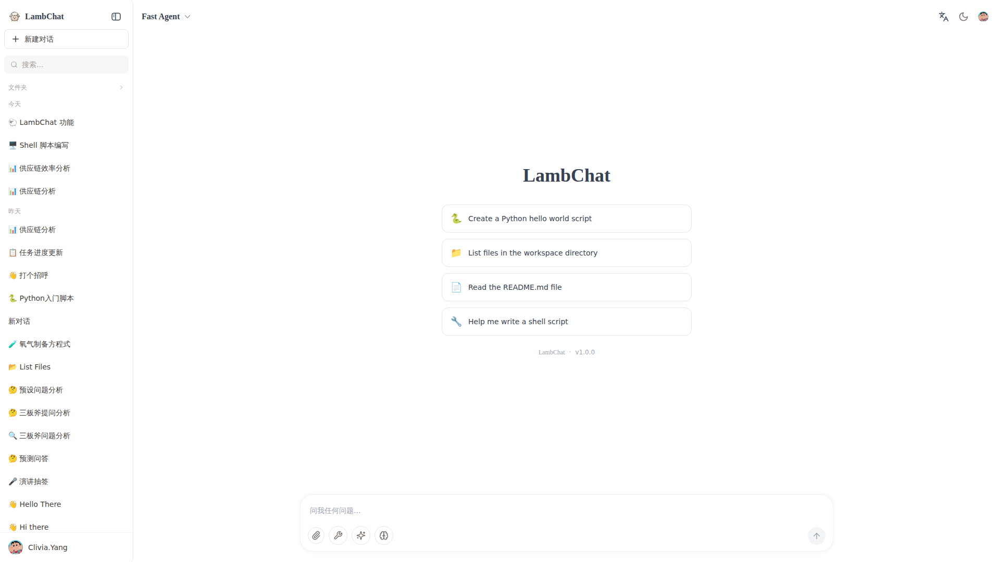
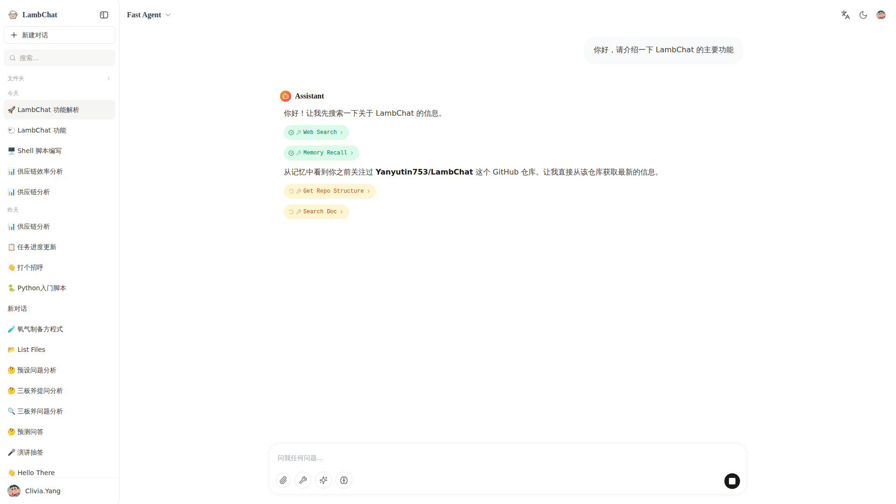
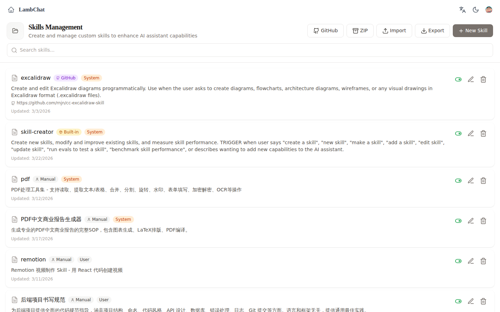
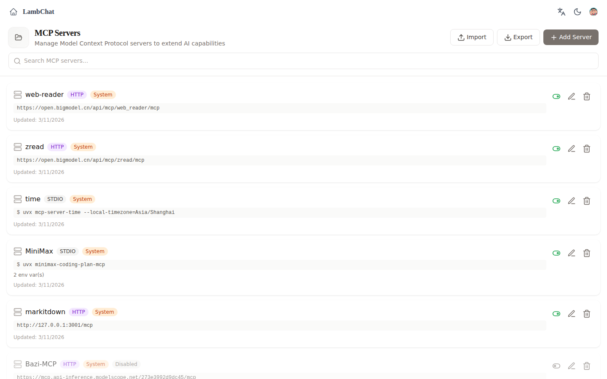
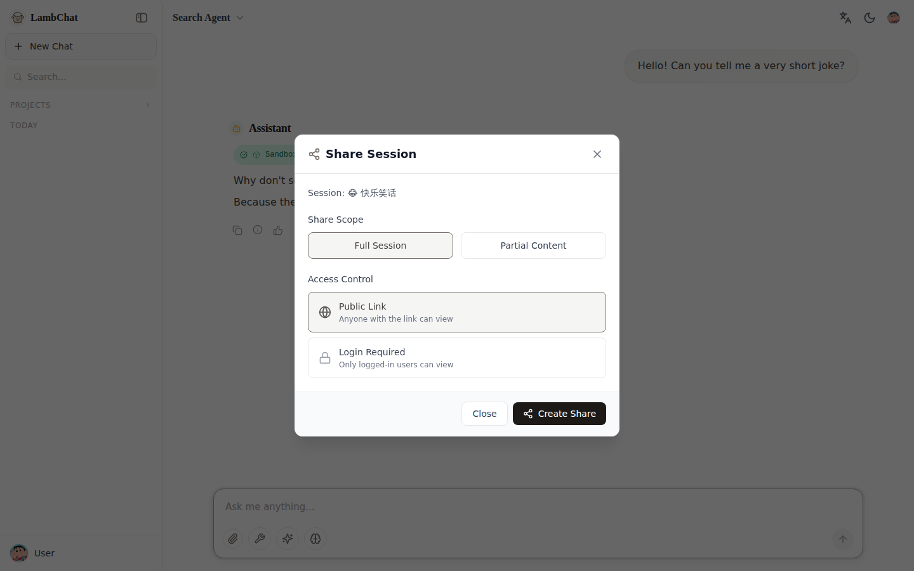
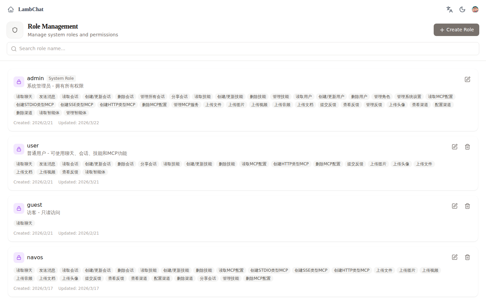
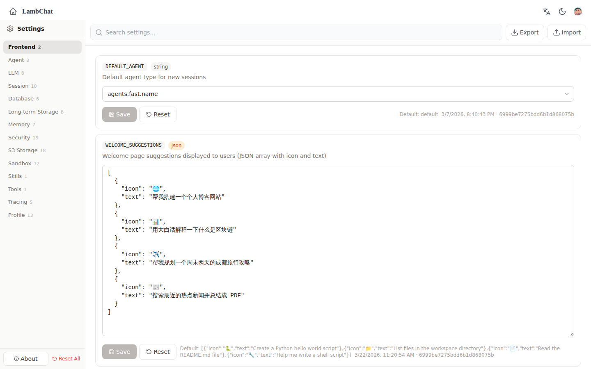
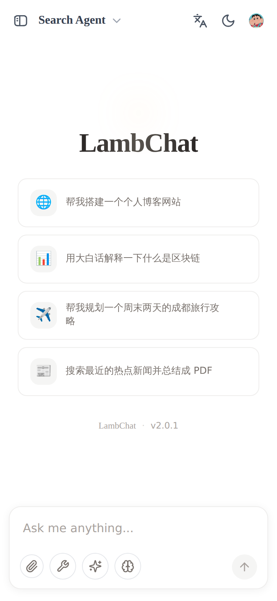

<div align="center">

# 🐑 LambChat

**A production-ready AI Agent system built with FastAPI + deepagents**

[]()
[]()
[]()
[]()
[]()
[]()
[](LICENSE)

[English](README.md) · [简体中文](README_CN.md) · [Contributing](CONTRIBUTING.md)

</div>

---

## 📸 Screenshots

| | | |
|:---:|:---:|:---:|
| <br>**Login** | <br>**Chat** | <br>**Streaming** |
| <br>**Skills** | <br>**MCP Config** | <br>**Share** |
| <br>**Roles** | <br>**Settings** | <br>**Mobile** |

## 🏗️ Architecture

<p align="center"></p>

## ✨ Features

<details>
<summary><b>🤖 Agent System</b></summary>

- **deepagents Architecture** — Compiled graph with fine-grained state management
- **Multi-Agent Types** — Core / Fast / Search agents
- **Plugin System** — `@register_agent("id")` decorator for custom agents
- **Streaming Output** — Native SSE support
- **Sub-agents** — Multi-level nesting
- **Thinking Mode** — Extended thinking for Anthropic models
- **Human-in-the-Loop** — Approval system for sensitive operations

</details>

<details>
<summary><b>🔌 MCP Integration</b></summary>

- **System + User Level** — Global and per-user MCP configs
- **Encrypted Storage** — API keys encrypted at rest
- **Dynamic Caching** — Tool caching with manual refresh
- **Multiple Transports** — stdio / SSE / HTTP
- **Permission Control** — Transport-level access control

</details>

<details>
<summary><b>🛠️ Skills System</b></summary>

- **Dual Storage** — File system + MongoDB backup
- **Access Control** — User-level permissions
- **GitHub Sync** — Import skills from GitHub repos
- **Skill Creator** — Built-in creation toolkit with evaluation tools

</details>

<details>
<summary><b>💬 Feedback · 📁 Files · 🔄 Realtime · 🔐 Auth · ⚙️ Tasks · 📊 Observability</b></summary>

- **Feedback** — Thumbs rating, text comments, session-linked, run-level stats
- **Documents** — PDF / Word / Excel / PPT / Markdown / Mermaid preview + image viewer
- **Cloud Storage** — S3 / OSS / MinIO integration, drag & drop upload
- **Realtime** — Dual-write (Redis + MongoDB), WebSocket, auto-reconnect, session sharing
- **Security** — JWT, RBAC (Admin/User/Guest), bcrypt, OAuth, email verification, sandbox
- **Tasks** — Concurrency control, cancellation, heartbeat, pub/sub notifications
- **Observability** — LangSmith tracing, structured logging, health checks
- **Channels** — Feishu (Lark) native integration, extensible multi-channel system

</details>

<details>
<summary><b>🎨 Frontend</b></summary>

- **React 19 + Vite + TailwindCSS**
- **ChatGPT-style** interface with dark/light theme
- **i18n** — English, Chinese, Japanese, Korean
- **Responsive** — Mobile, tablet, desktop

</details>

## ⚙️ Configuration

14 setting categories configurable via UI or environment variables:

| Category | Description |
|----------|-------------|
| Frontend | Default agent, welcome suggestions, UI preferences |
| Agent | Debug mode, logging level |
| LLM | Model, temperature, max tokens, API key & base URL |
| Session | Session management |
| Database | MongoDB connection |
| Storage | Persistent storage, S3/OSS/MinIO |
| Security | Encryption & security policies |
| Sandbox | Code sandbox settings |
| Skills | Skill system config |
| Tools | Tool system settings |
| Tracing | LangSmith & tracing |
| User | User management |
| Memory | Memory system (hindsight) |

## 🚀 Quick Start

### Prerequisites

- Python 3.12+ · Node.js 18+ · MongoDB · Redis

### Setup

```bash
git clone https://github.com/Yanyutin753/LambChat.git
cd LambChat

cp .env.example .env   # Edit with your config

# Docker (recommended)
docker-compose up -d

# Or local development
make install && make dev
```

→ Open **http://localhost:8000**

### Code Quality

```bash
ruff format src/    # Format
ruff check src/     # Lint
mypy src/           # Type check
```

### Project Structure

```
src/
├── agents/          # Agent implementations (core, fast, search)
├── api/             # FastAPI routes & middleware
├── infra/           # Infrastructure services
│   ├── agent/       # Agent config & events
│   ├── auth/        # JWT authentication
│   ├── channel/     # Multi-channel (Feishu, etc.)
│   ├── feedback/    # Feedback system
│   ├── llm/         # LLM integration
│   ├── mcp/         # MCP protocol
│   ├── memory/      # Memory & hindsight
│   ├── role/        # RBAC
│   ├── sandbox/     # Sandbox execution
│   ├── session/     # Session management (dual-write)
│   ├── skill/       # Skills system
│   ├── storage/     # S3/OSS/MinIO
│   ├── task/        # Task management
│   ├── tool/        # Tool registry & MCP client
│   └── ...
├── kernel/          # Core schemas, config, types
└── skills/          # Built-in skills
```

## ⭐ Star History

<a href="https://star-history.com/#Yanyutin753/LambChat&Date">
 <picture>
   <source media="(prefers-color-scheme: dark)" srcset="https://api.star-history.com/svg?repos=Yanyutin753/LambChat&type=Date&theme=dark" />
   <source media="(prefers-color-scheme: light)" srcset="https://api.star-history.com/svg?repos=Yanyutin753/LambChat&type=Date" />
   
 </picture>
</a>

## 📄 License

[MIT](LICENSE) — Project name "LambChat" and its logo may not be changed or removed.

---

<div align="center">

Made with ❤️ by [Clivia](https://github.com/Yanyutin753)

[📧 3254822118@qq.com](mailto:3254822118@qq.com) · [GitHub](https://github.com/Yanyutin753)

</div>
